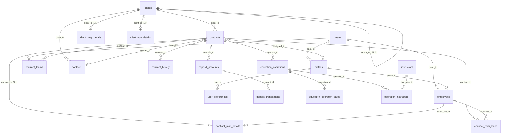

# NXT CRM v2 — DB 스키마 문서

> **정본 출처**: `supabase/schema.sql` (운영 DB `ghuevnxgcdltgupoddsn` 추출본)
> 이 문서는 사람이 읽기 위한 설명이며, 정확한 DDL은 항상 `schema.sql`이 기준이다.
> 스키마 변경 시 `schema.sql` 재추출과 함께 이 문서도 갱신한다.

PostgreSQL (Supabase) · 확장: `pg_trgm`(부분 검색) · 테이블 20개 · 뷰 2개 · ENUM 16개 · 전 테이블 RLS 활성화.

---

## 1. 도메인 구성

| 도메인 | 테이블 |
|---|---|
| **팀·권한·사용자** | `teams`, `team_business_domains`, `profiles`, `employees`, `user_preferences` |
| **고객** | `clients`, `client_msp_details`, `client_edu_details`, `contacts` |
| **계약** | `contracts`, `contract_msp_details`, `contract_teams`, `contract_tech_leads`, `contract_history` |
| **예치금** | `deposit_accounts`, `deposit_transactions` |
| **교육 운영** | `education_operations`, `education_operation_dates`, `instructors`, `operation_instructors` |

### 공통 규칙
- **PK**: 대부분 `id uuid DEFAULT gen_random_uuid()` (예외: `contract_tech_leads`는 복합 PK, `team_business_domains`는 enum 복합 PK)
- **Soft delete**: `deleted_at timestamptz`가 있는 테이블은 삭제하지 않고 이 컬럼을 채운다. 조회는 `deleted_at IS NULL` 필터.
- **updated_at**: 해당 컬럼이 있는 테이블은 `update_updated_at()` 트리거가 자동 갱신.
- **RLS**: 모든 테이블 RLS 활성화. 접근 제어는 `can_access_client()` / `can_access_contract()` 함수 기반(§6).

---

## 2. ERD

> `team_business_domains`는 FK가 아닌 **enum 값 매핑 테이블**(팀유형 ↔ 사업유형)이라 ERD에서 분리. RLS 접근 판정에만 사용.

---

## 3. ENUM 타입 (16개)

| 타입 | 값 | 사용처 |
|---|---|---|
| `user_role` | staff, team_lead, admin, c_level | `profiles.role` (권한) |
| `team_type` | msp, tt, dev, ops, ai, ptn | `teams.type` (tt=Technical Training) |
| `business_type` | msp, edu, dev | `clients.business_types[]`, 도메인 매핑 |
| `client_type` | univ, corp, govt, asso, etc | `clients.client_type` (client_id 접두어) |
| `client_grade` | A, B, C, D, E | `clients.grade` |
| `client_status_type` | 신규, 진행중, 활성, 휴면, 종료, 상태없음 | `clients.status` |
| `industry_type` | IT, 제조, 금융, 유통, 공공, 서울대 연구실, 기타 | `client_msp_details.industry` |
| `company_size_type` | 스타트업, 중소기업, 중견기업, 대기업, 공공기관 | `client_msp_details.company_size` |
| `contract_type` | msp, edu, dev | `contracts.type` |
| `currency_type` | KRW, USD | `contracts.currency` |
| `credit_share_type` | 가능, 불가능, 미정 | `contract_msp_details.credit_share` |
| `msp_grade_type` | None, FREE, MSP10, MSP15, MSP20, ETC | `contract_msp_details.msp_grade` |
| `payer_type` | ETV-AWS-13, ETV-AWS-14, Org-001, Billing Transfer | `contract_msp_details.payer` |
| `billing_method_type` | 대표님 직접 청구, 매월 10일 세금계산서 발행, 공공기관 별도 청구 | `contract_msp_details.billing_method` |
| `deposit_txn_type` | deposit, usage, adjustment, refund | `deposit_transactions.txn_type` |
| `deposit_txn_source` | manual, aws_api, billing_on | `deposit_transactions.source` |

---

## 4. 테이블 상세

### 4.1 팀·권한·사용자

#### `teams` — 조직 팀
| 컬럼 | 타입 | 제약 | 설명 |
|---|---|---|---|
| id | uuid | PK | |
| name | text | NOT NULL, UNIQUE | 팀 표시명 |
| type | team_type | NOT NULL | msp / tt / dev / ops / ai / ptn |
| created_at | timestamptz | NOT NULL | |

#### `team_business_domains` — 팀유형 ↔ 사업유형 매핑 (접근 제어 핵심)
| 컬럼 | 타입 | 제약 | 설명 |
|---|---|---|---|
| team_type | team_type | PK | |
| business_type | business_type | PK | |

> 시드: (ops,edu)(ops,msp)(tt,edu)(dev,dev)(ai,msp)(ptn,msp). `can_access_*` 함수가 "내 팀유형이 접근 가능한 사업유형"을 이 표로 판정.

#### `profiles` — 인증 사용자 (auth.users 1:1)
| 컬럼 | 타입 | 제약 | 설명 |
|---|---|---|---|
| id | uuid | PK, FK→auth.users(CASCADE) | Supabase 인증 유저 id |
| name | text | NOT NULL | |
| email | text | NOT NULL, UNIQUE | |
| role | user_role | NOT NULL, default staff | 권한 등급 |
| team_id | uuid | FK→teams | 소속 팀 |
| position | text | | 직책 |

> 신규 auth.users 생성 시 `handle_new_user()` 트리거가 profiles row 자동 생성.

#### `employees` — 직원 마스터 (영업·기술 담당 지정용)
| 컬럼 | 타입 | 제약 | 설명 |
|---|---|---|---|
| id | uuid | PK | |
| name | text | NOT NULL | |
| email / phone / position | text | | |
| team_id | uuid | FK→teams | |
| profile_id | uuid | FK→profiles | 로그인 계정 연결(있으면) |
| is_active | boolean | default true | |
| is_sales_rep | boolean | NOT NULL, default false | 영업 담당 후보 여부 |

> `profiles`(로그인 계정)와 `employees`(업무상 직원)는 별개. 계약의 영업/기술 담당은 `employees`를 참조.

#### `user_preferences` — 사용자별 UI 환경설정
| 컬럼 | 타입 | 제약 | 설명 |
|---|---|---|---|
| id | uuid | PK | |
| user_id | uuid | NOT NULL, UNIQUE, FK→profiles(CASCADE) | |
| preferences | jsonb | NOT NULL, default {} | 컬럼 표시 설정 등 |

---

### 4.2 고객

#### `clients` — 고객 (CRM 자산, 삭제 대신 soft delete)
| 컬럼 | 타입 | 제약 | 설명 |
|---|---|---|---|
| id | uuid | PK | |
| client_id | text | NOT NULL, UNIQUE | 표시 ID (`UNIV-001` 등, `generate_client_id`) |
| name | text | NOT NULL | gin trgm 인덱스(부분 검색) |
| client_type | client_type | NOT NULL | univ/corp/govt/asso/etc |
| grade | client_grade | | A~E |
| business_types | business_type[] | default {} | 이 고객이 속한 사업유형(접근 제어에 사용) |
| parent_id | uuid | FK→clients(SET NULL) | 상위 고객 (계층 **2단계까지**, 트리거 강제) |
| status | client_status_type | NOT NULL, default 상태없음 | |
| memo | text | | |
| deleted_at | timestamptz | | soft delete |

#### `client_msp_details` — 고객 MSP 확장 (1:1)
| 컬럼 | 타입 | 제약 | 설명 |
|---|---|---|---|
| id | uuid | PK | |
| client_id | uuid | NOT NULL, UNIQUE, FK→clients(CASCADE) | |
| industry | industry_type | | |
| company_size | company_size_type | | |
| memo | text | | |
| deleted_at | timestamptz | | |

#### `client_edu_details` — 고객 교육 확장 (1:1)
| 컬럼 | 타입 | 제약 | 설명 |
|---|---|---|---|
| id | uuid | PK | |
| client_id | uuid | NOT NULL, UNIQUE, FK→clients(CASCADE) | |
| edu_grade | text | | |
| memo | text | | |
| deleted_at | timestamptz | | |

#### `contacts` — 고객 연락처
| 컬럼 | 타입 | 제약 | 설명 |
|---|---|---|---|
| id | uuid | PK | |
| client_id | uuid | NOT NULL, FK→clients(CASCADE) | |
| name | text | NOT NULL | gin trgm 인덱스 |
| email / phone / department / position / role | text | | |
| is_primary | boolean | default false | 대표 연락처 여부 |
| deleted_at | timestamptz | | |

---

### 4.3 계약

#### `contracts` — 계약 (통합 모델: MSP/교육/개발)
| 컬럼 | 타입 | 제약 | 설명 |
|---|---|---|---|
| id | uuid | PK | |
| contract_id | text | NOT NULL, UNIQUE | 표시 ID (`MSP-001`, `CT2026001`) |
| client_id | uuid | NOT NULL, FK→clients | |
| type | contract_type | NOT NULL | msp/edu/dev |
| name | text | NOT NULL | 계약명 (gin trgm 인덱스, 헤더에서 인라인 수정) |
| memo | text | | |
| total_amount | bigint | default 0 | 계약 금액 |
| currency | currency_type | default KRW | |
| stage | text | CHECK(타입별 단계) | 파이프라인 단계 ↓ |
| assigned_to | uuid | FK→profiles | 사내 담당자 |
| contact_id | uuid | FK→contacts | 고객사 담당자 |
| deleted_at | timestamptz | | soft delete (예치금 잔액≠0이면 트리거가 차단) |

> **stage CHECK 제약**:
> - `msp`: pre_contract → billing_complete → project_closed → unpaid
> - `tt`(교육): proposal → contracted → operating → op_completed → settled
> - `dev`: 제약 없음

#### `contract_msp_details` — 계약 MSP 운영 상세 (1:1)
| 컬럼 | 타입 | 제약 | 설명 |
|---|---|---|---|
| id | uuid | PK | |
| contract_id | uuid | NOT NULL, UNIQUE, FK→contracts(CASCADE) | |
| credit_share | credit_share_type | | 크레딧 셰어 |
| expected_mrr | bigint | | 예상 월 반복 매출 |
| payer | payer_type | | 결제 주체 |
| aws_amount | bigint | | |
| has_management_fee | boolean | default false | |
| billing_method | billing_method_type | | 청구 방식 |
| sales_rep_id | uuid | FK→employees | 영업 담당 |
| aws_account_ids | text[] | default {} | AWS 계정 ID 목록 |
| aws_account_search | text | GENERATED(STORED) | `aws_account_ids` 배열→텍스트, gin trgm 부분 검색용 |
| aws_am | text | | AWS AM |
| msp_grade | msp_grade_type | | None/FREE/MSP10/15/20/ETC |
| billing_on / billing_on_alias | boolean / text | | 빌링온 등록 여부·별칭 |
| root_account_email | text | | 루트 계정 메일 |
| tags | text[] | default {} | |
| deleted_at | timestamptz | | |

#### `contract_teams` — 팀별 매출 배분 (M:N)
| 컬럼 | 타입 | 제약 | 설명 |
|---|---|---|---|
| id | uuid | PK | |
| contract_id | uuid | NOT NULL, FK→contracts(CASCADE) | (contract_id, team_id) UNIQUE |
| team_id | uuid | NOT NULL, FK→teams | |
| percentage | numeric(5,2) | CHECK(0<p≤100) | 배분 비율 |
| deleted_at | timestamptz | | |

> 갱신은 `update_contract_teams(contract_id, allocations jsonb)` RPC로 전체 교체.

#### `contract_tech_leads` — 계약 담당 기술 (M:N, 복합 PK)
| 컬럼 | 타입 | 제약 | 설명 |
|---|---|---|---|
| contract_id | uuid | PK, FK→contracts(CASCADE) | |
| employee_id | uuid | PK, FK→employees(CASCADE) | |

> 갱신은 `replace_contract_tech_leads(contract_id, employee_ids[])` RPC로 전체 교체.

#### `contract_history` — 계약 변경 이력 (단계 변경 + 필드 변경)
| 컬럼 | 타입 | 제약 | 설명 |
|---|---|---|---|
| id | uuid | PK | |
| contract_id | uuid | NOT NULL, FK→contracts(CASCADE) | |
| from_stage / to_stage | text | | 단계 변경 시 |
| field_name | text | default 'stage' | 변경된 필드명 (예: '계약명', '금액') |
| old_value / new_value | text | | 필드 변경 전/후 값 |
| changed_by | uuid | NOT NULL, FK→profiles | |
| note | text | | |

> 단계 변경은 `change_contract_stage()` RPC, 일반 필드 변경은 앱의 `logChanges()`가 기록.

---

### 4.4 예치금 (MSP 선결제 잔액 관리)

#### `deposit_accounts` — 예치금 계좌 (계약당 활성 1개)
| 컬럼 | 타입 | 제약 | 설명 |
|---|---|---|---|
| id | uuid | PK | |
| contract_id | uuid | NOT NULL, FK→contracts | 활성 계좌 1개 (부분 unique index, `deleted_at IS NULL`) |
| balance | bigint | NOT NULL, default 0 | 현재 잔액 (트리거 자동 계산) |
| total_deposit | bigint | NOT NULL, default 0 | 누적 입금 (트리거) |
| total_usage | bigint | NOT NULL, default 0 | 누적 사용 (트리거) |
| last_recalc_at | timestamptz | | 마지막 재계산 시각 |
| deleted_at | timestamptz | | 비활성화(잔액 0 + 권한 시에만, 트리거 강제) |

> `balance = Σdeposit − Σusage + Σadjustment − Σrefund` (무효화 제외). 거래 변경 시 `recalc_deposit_account_balance()` 트리거가 재계산.

#### `deposit_transactions` — 예치금 거래
| 컬럼 | 타입 | 제약 | 설명 |
|---|---|---|---|
| id | uuid | PK | |
| account_id | uuid | NOT NULL, FK→deposit_accounts | |
| txn_date | date | NOT NULL | |
| txn_type | deposit_txn_type | NOT NULL | deposit/usage/adjustment/refund |
| amount | bigint | NOT NULL, CHECK | deposit/usage/refund는 >0, adjustment는 ≠0 |
| memo | text | | |
| source | deposit_txn_source | NOT NULL, default manual | |
| created_by | uuid | FK→profiles | |
| voided_at / voided_by / void_reason | timestamptz / uuid / text | | 무효화 (삭제 대신 보존) |

> 무효화는 행 삭제가 아니라 `voided_at` 기록. 비활성 계좌엔 거래 등록 불가(무효화만 허용, `assert_deposit_account_active()` 트리거).

---

### 4.5 교육 운영

#### `education_operations` — 교육 운영 (계약 하위)
| 컬럼 | 타입 | 제약 | 설명 |
|---|---|---|---|
| id | uuid | PK | |
| contract_id | uuid | NOT NULL, FK→contracts(CASCADE) | |
| operation_name | text | NOT NULL | |
| location / target_org | text | | |
| start_date / end_date | date | | |
| total_hours | numeric(6,1) | | |
| contracted_count / recruited_count / actual_count | integer | | 계약/모집/실제 인원 |
| provides_lunch / provides_snack | boolean | default false | |
| date_list | date[] | default {} | 교육 실시일 배열 |
| notes | text | | |
| deleted_at | timestamptz | | |

#### `education_operation_dates` — 교육 일자별 상세
| 컬럼 | 타입 | 제약 | 설명 |
|---|---|---|---|
| id | uuid | PK | |
| operation_id | uuid | NOT NULL, FK→education_operations(CASCADE) | |
| education_date | date | NOT NULL | |
| hours | numeric | default 0 | |

#### `instructors` — 강사 마스터 (내부·외부)
| 컬럼 | 타입 | 제약 | 설명 |
|---|---|---|---|
| id | uuid | PK | |
| name | text | NOT NULL | |
| email / phone / organization / team / position | text | | |
| status | text | default 활동 | |

#### `operation_instructors` — 운영-강사 배정 (M:N)
| 컬럼 | 타입 | 제약 | 설명 |
|---|---|---|---|
| id | uuid | PK | |
| operation_id | uuid | NOT NULL, FK→education_operations(CASCADE) | |
| instructor_id | uuid | NOT NULL, FK→instructors | |
| role | text | NOT NULL | 주강사/보조 등 |
| assigned_date | date | | |
| notes | text | | |

---

## 5. 뷰 (2개)

| 뷰 | 설명 |
|---|---|
| `client_list_view` | `clients`(미삭제) + 활성 계약 수(`contract_count`). 고객 목록 화면용 |
| `contracts_with_details` | `contracts`(미삭제) + `contract_msp_details` + 고객명/표시ID + 사내담당자명 조인. 계약 목록·상세용 |

---

## 6. RLS · 접근 제어

전 테이블 RLS 활성화. 핵심 판정 함수(SECURITY DEFINER):

| 함수 | 판정 |
|---|---|
| `user_role()` / `user_team_id()` | 현재 로그인 사용자의 role / 소속 팀 |
| `is_admin_or_clevel()` | admin 또는 c_level |
| `is_admin_clevel_or_lead()` | admin · c_level · team_lead (예치금 관리 권한) |
| `can_access_client(id)` | admin·c_level는 전체 / 그 외엔 **고객 business_types ∩ 내 팀의 도메인**(team_business_domains) 교집합 존재 시 |
| `can_access_contract(id)` | admin·c_level는 전체 / 그 외엔 **계약 type이 내 팀 도메인에 포함** OR `contract_teams`에 내 팀 매핑(fallback) |

### 테이블별 정책 요약
- **clients / contacts / client_*_details**: `can_access_client` 기반 (SELECT는 인증 사용자 전체 허용, 변경은 접근 권한자)
- **contracts / contract_* / education_* / contract_history**: `can_access_contract` 기반
- **deposit_accounts**: `can_access_contract` + 계약 type=msp 한정. INSERT는 활성 msp 계약만
- **deposit_transactions**: 계좌 접근 권한 필요. deposit/usage INSERT는 접근자, **adjustment/refund INSERT·void는 admin·c_level·team_lead**
- **employees**: SELECT는 인증 사용자, **C·U·D는 admin만**
- **profiles**: SELECT 전체, UPDATE는 본인만
- **user_preferences**: 본인(`user_id = auth.uid()`)만
- **teams / instructors / education_operation_dates**: SELECT 전체 허용

---

## 7. 함수·트리거 요약

### 다단계 쓰기 RPC (SECURITY DEFINER + 접근 가드, 트랜잭션 보장)
| 함수 | 역할 |
|---|---|
| `create_contract_with_details(jsonb)` | 계약 생성 + MSP 상세 생성 + 고객 business_types 갱신 (contract_id 자동 발번) |
| `change_contract_stage(...)` | 단계 변경 + `contract_history` 기록 |
| `replace_contract_tech_leads(...)` | 담당 기술 전체 교체 |
| `update_contract_teams(...)` | 매출 배분 전체 교체 |
| `soft_delete_contract(id)` | 계약 + 연관(teams/msp/deposit) soft delete |
| `soft_delete_client(id)` | 고객 + 연관(contacts/details) soft delete |
| `generate_client_id` / `generate_msp_contract_id` / `generate_edu_contract_id` | 표시 ID 발번 |

### 무결성 트리거
| 트리거 | 테이블 | 역할 |
|---|---|---|
| `update_updated_at` | 다수 | updated_at 자동 갱신 |
| `check_client_hierarchy` | clients | 고객 계층 2단계 제한 |
| `handle_new_user` | auth.users | 신규 가입 시 profiles 생성 |
| `recalc_deposit_account_balance` | deposit_transactions | 거래 변경 시 계좌 잔액 재계산 |
| `assert_deposit_account_active` | deposit_transactions | 비활성 계좌 거래 차단(void만 허용) |
| `assert_deposit_deactivation_safe` | deposit_accounts | 비활성화 = 잔액 0 + 권한자만 |
| `guard_contract_delete_with_deposit` | contracts | 예치금 잔액≠0이면 계약 종료 차단 |

---

## 8. 인덱스 주요 사항
- **부분 인덱스**(`deleted_at IS NULL` / `voided_at IS NULL`): clients/contacts/contracts active, deposit active 등 — 미삭제 행만 인덱싱
- **gin trgm 부분 검색**: `clients.name`, `contacts.name`, `contracts.name`, `contract_msp_details.aws_account_search`
- **활성 계좌 유일성**: `deposit_accounts_contract_id_active_unique` (계약당 활성 예치금 계좌 1개 보장, 부분 unique)
